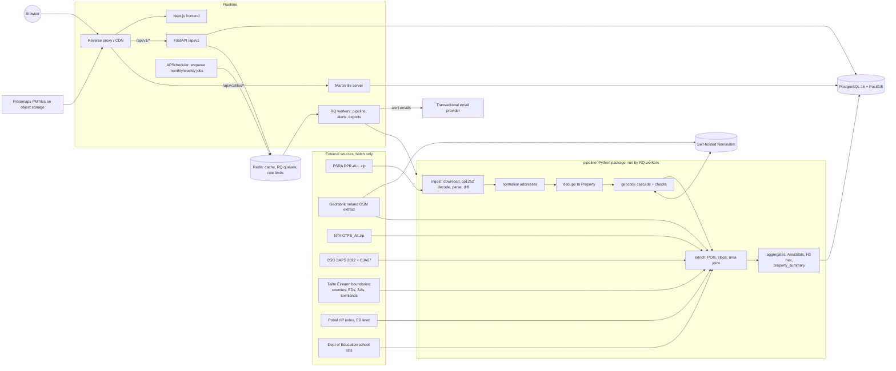

# Architecture

Status: Phase 0 draft, 2026-09-26. The decisions referenced as D-xxx are in [DECISIONS.md](DECISIONS.md).

## Goals that shape the design

1. **The hover card never waits on a third party.** All enrichment is precomputed per Property, Small Area, ED or H3 cell.
2. **The map scales to every sale in Ireland** without large JSON payloads: server-side vector tiles, with aggregation at low zoom.
3. **Every value is honest about its origin.** Each location carries a geocode confidence. Each enriched value carries its source and as-of date. Nothing is invented: no bedrooms, sizes or photos.
4. **Data changes monthly, reads are constant.** The system is read-heavy, so caching pays off.

## System diagram

## Stack

The brief's stack is kept, with these adjustments:

| Layer | Choice | Change from brief |
|---|---|---|
| Frontend | Next.js (App Router, TypeScript), Tailwind, MapLibre GL JS | none |
| Basemap | Self-hosted Protomaps PMTiles for Ireland | picks one option (D-005) |
| API | FastAPI, Python 3.12, SQLAlchemy 2 (async), Alembic, Pydantic v2 | none |
| DB | PostgreSQL 16 + PostGIS 3, plus `pg_trgm` and `citext` extensions; H3 computed in Python (D-024) | adds extensions (D-006, D-009) |
| Tiles | Martin with a PostGIS function source | Martin chosen over `ST_AsMVT`-in-FastAPI (D-004) |
| Jobs | RQ workers + one APScheduler process | picks RQ (D-007) |
| Geocoder | Self-hosted Nominatim (Ireland extract), batch only | new component (D-003) |
| Auth | Opaque server-side sessions, argon2id | drops JWT refresh (D-008) |
| Local dev | Docker Compose (`infra/docker-compose.yml`): PostGIS, Redis, API, worker, Martin, Next.js, Caddy (one origin, D-026), Mailpit; Nominatim behind an opt-in profile | adds services |
| CI | GitHub Actions: ruff + mypy + pytest; eslint + tsc + vitest; Playwright on main | none |

## Data flow

### Monthly ingest

The scheduler runs this on the 1st and on demand from admin. Each step is idempotent and logged to `ingest_run`.

1. **Download** `PPR-ALL.zip`. Record sha256 and size, and skip the run if unchanged.
2. **Parse:** decode as cp1252, validate 9 fields, parse date, price (`NUMERIC(12,2)`) and flags, and map descriptions to an enum. Rows that fail go to `ingest_row_error` with the reason.
3. **Diff** by `source_row_hash` (D-001): insert new rows and mark withdrawn ones.
4. **Normalise** the address:
   - Casefold and expand abbreviations (`RD`→Road, `AVE`→Avenue, `ST`→Street or Saint by context).
   - Strip junk (`N/A`).
   - Split out the unit (`Apt 5`, `Unit 3`, `Block A`).
   - Extract the Dublin postal district and the Eircode routing key.
   - Validate the Eircode format.
5. **Deduplicate into Property:**
   - First by exact `(county, address_key)`, where `address_key` is the normalised address minus punctuation.
   - Then by validated Eircode.
   - Then by a fuzzy candidate match: trigram similarity ≥ 0.9, same number and unit, same county.
   - Uncertain merges are **not** made automatically. They go to an admin review queue.
6. **Geocode** new or changed Properties with the D-003 cascade and store every attempt in `geocode_attempt`.
7. **Spatial joins:** attach `small_area_id`, `ed_id`, `townland_id`, `settlement_id` and `h3_r8` by point-in-polygon.
8. **Flag outliers:** `not_full_market_price` (from PPR), `vat_exclusive` (from PPR), and `bulk_group_id` (heuristic: at least 3 rows with the same date, price and county, or the same date and price above €5M) with a group size.
9. **Aggregate:** refresh `area_stats` (with median and count suppression when n < 5), the H3 price hexes and `property_summary` (hover JSON). Then invalidate the tile cache and pre-warm the default tiles.

### Enrichment refresh

Each source has its own job and schedule. See [external-services.md](external-services.md).

- **Transport:** GTFS_All.zip, weekly → the `poi` table (type = `bus_stop | luas_stop | rail_station | dart_station`).
- **Amenities:** a Geofabrik Ireland extract, monthly, filtered locally with osmium. There are no Overpass calls at scale, because we are already downloading the extract.
- **Area data:** Census SAPS, Pobal, boundaries and schools reload when a new release is published, which is rare.
- **Per-property precompute:** the nearest stop of each type and its distance, the nearest school of each level, amenity counts within 1 km by category, and ED deprivation band. This is stored in `property_enrichment` with a source and as-of date per value.

### Request path: hover card

The target is < 100 ms. The flow is:
1. Browser hover, debounced by 150 ms.
2. `GET /api/v1/properties/{id}/summary`.
3. Redis lookup (`summary:{id}:{data_version}`).
4. On a miss, a single-row read of `property_summary.payload` (JSONB, precomputed), which is written back to Redis.

There are no joins and no third-party calls on this path.

## Deployment (not decided yet: see open questions)

- **Minimum footprint:** one VM with 4 vCPU and 16 GB RAM, running Postgres, API, Martin, workers and Redis, plus Nominatim during batch runs only.
- **Storage:** object storage and a CDN for basemap tiles and static assets. Managed Postgres is optional.
- **Estimated DB size:** under 10 GB, covering about 810k sales, 700k properties, POIs and boundaries.
- Nominatim for Ireland can run on the same VM during the monthly window, or on a temporary machine.

## Cross-cutting

- **Attribution footer and `/sources` page:** PSRA, OSM (ODbL), CSO, Tailte Éireann, NTA, Pobal, SEAI, as each licence requires.
- **Data freshness:** `data_version` = the PPR max sale date plus the ingest timestamp. It drives the banner ("PPR data up to 18 Sep 2026") and the cache keys. The latest two months are labelled provisional.
- **Observability:** structured JSON logs, request IDs, Sentry (optional, needs approval), and ingest run metrics in the admin dashboard.
