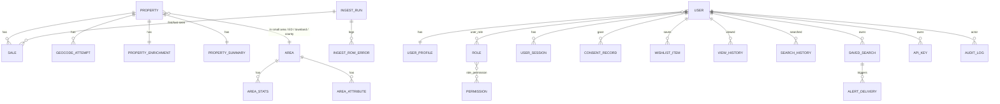

# Data model (Phase 0 draft)

## Conventions

- PostgreSQL 16 + PostGIS 3. Primary keys are `bigint generated always as identity` for data tables and `uuid` (`gen_random_uuid()`) for user-facing tables whose IDs appear in URLs or exports.
- H3 cells are stored as `bigint`, computed in the pipeline with the `h3` Python library, so the stock PostGIS image works without the `h3-pg` extension (D-024).
- Every table has `created_at timestamptz not null default now()`. Mutable tables also have `updated_at`.
- Geometry is stored as `geometry(…, 4326)`. Distance work uses `geography` casts or ITM (EPSG:2157) where precision matters.
- **Every geometry column has a GIST index.**
- Money is `numeric(12,2)` in EUR. We never use float.
- Enums are Postgres enums, created by Alembic.

Scale today: 807,724 sales, ~650–700k properties (after dedupe), ~19k Small Areas, ~3.4k EDs, ~50k townlands, 139 routing keys, POIs in the low hundreds of thousands.

## ER overview

## Data tables

### `ingest_run`
| column | type | notes |
|---|---|---|
| id | bigint PK | |
| kind | enum `ppr, gtfs, osm, census, pobal, schools, boundaries, crime` | |
| started_at, finished_at | timestamptz | |
| status | enum `running, succeeded, failed, skipped_unchanged` | |
| source_url, source_sha256, source_bytes | text, text, bigint | |
| rows_read, rows_inserted, rows_withdrawn, rows_failed | int | |
| stats | jsonb | geocode counts per confidence, timings |
| triggered_by | uuid FK user null | null = scheduler |

### `ingest_row_error`
`id, ingest_run_id FK, line_no int, raw_line text, error text`. Index: `(ingest_run_id)`.

### `property`
| column | type | notes |
|---|---|---|
| id | bigint PK | |
| public_id | text unique | short slug for URLs |
| address_display | text | best cleaned form for display |
| address_normalised | text | lowercase, expanded abbreviations |
| address_key | text | normalised minus unit, trailing county and punctuation; dedupe key. Addresses with no house number and no unit get a `~<sale id>` suffix so they never merge (D-030) |
| unit | text null | `apt 5`, `unit 3`, … |
| house_number | text null | |
| county | enum of 26 counties | from PPR, majority vote across sales |
| dublin_district | text null | `D6W`, `D15`, … |
| eircode | char(7) null | validated format; never shown for an unconfirmed match |
| eircode_routing_key | char(3) null | |
| geom | geometry(Point,4326) null | null = unmatched |
| geocode_confidence | enum `exact, street, locality, routing_key, county, unmatched` | |
| geocode_method | text | e.g. `nominatim:house`, `townland_centroid`, `eircode_ecad`, `admin_manual` |
| geocode_source | text | e.g. `OSM (ODbL)`, `Tailte Éireann`, `admin` |
| geocoded_at | timestamptz | |
| geocode_locked | bool default false | set by admin correction; pipeline won't overwrite |
| small_area_id, ed_id, townland_id, settlement_id | bigint FK area null | spatial joins |
| h3_r8 | bigint null | H3 cell id (D-024) |
| is_suppressed | bool default false | removal request honoured (hidden from public views) |

Indexes:
- `GIST(geom)`
- `unique(county, address_key, coalesce(unit,''))`
- `GIN(address_normalised gin_trgm_ops)`
- `(eircode)`, `(eircode_routing_key)`, `(small_area_id)`, `(h3_r8)`
- a partial index `WHERE geocode_confidence IN ('exact','street')` for comparables

### `sale`
| column | type | notes |
|---|---|---|
| id | bigint PK | |
| property_id | bigint FK property | |
| source_row_hash | char(64) unique | D-001 |
| raw_date, raw_address, raw_county, raw_eircode, raw_price, raw_nfmp, raw_vat, raw_description, raw_size | text | verbatim, cp1252-decoded |
| sale_date | date | |
| price_eur | numeric(12,2) | as filed |
| not_full_market_price | bool | |
| vat_exclusive | bool | |
| is_new | bool | from description |
| size_band | enum `lt_38, 38_to_125, gte_125` null | normalised from the free text; ~7% of rows, new builds 2010–2018 only |
| bulk_group_id | bigint null | heuristic grouping of portfolio sales |
| bulk_group_size | int null | |
| is_possible_duplicate | bool | exact duplicate of another row |
| first_seen_run_id, last_seen_run_id | FK ingest_run | |
| withdrawn_at | timestamptz null | row vanished from PPR |

Indexes:
- `(property_id, sale_date desc)`
- `(sale_date)`
- `(price_eur)`
- a BRIN index on `(sale_date)` for range scans
- a partial index `WHERE NOT not_full_market_price AND bulk_group_id IS NULL AND withdrawn_at IS NULL` for the default "market sales" filter

### `geocode_attempt`
`id, property_id FK, run_id FK, step int, method text, query text, candidate_geom geometry(Point,4326) null, candidate_type text, confidence enum, score real, accepted bool, reject_reason text null (county_conflict, implausible_type, …), raw_response jsonb, created_at`

Indexes: `(property_id)`, `GIST(candidate_geom)`.
Raw responses are kept for 90 days, then dropped to save space.

### `area`
| column | type | notes |
|---|---|---|
| id | bigint PK | |
| kind | enum `country, county, local_authority, electoral_division, small_area, townland, settlement, routing_key, dublin_district` | one `country` row, `ireland`, is made by the aggregate step from the counties (D-049) |
| code | text | official code (e.g. SA GUID/code, ED code) |
| name, name_ga | text | |
| parent_id | bigint FK area null | county ← ED ← SA |
| geom | geometry(MultiPolygon,4326) | generalised for display |
| geom_full | geometry(MultiPolygon,2157) | ungeneralised for point-in-polygon |
| source, source_version | text | e.g. `Tailte Éireann 2022 SA ungeneralised` |
| slug | text unique | for area pages |

Indexes: `unique(kind, code)`, `GIST(geom)`, `GIST(geom_full)`, `GIN(name gin_trgm_ops)`.

### `area_part`
`id, area_id FK area (cascade), kind area_kind, geom geometry(MultiPolygon,2157)`: each `area.geom_full` cut by `ST_Subdivide` into pieces of at most 256 vertices. Rebuilt by the pipeline whenever a layer loads. It makes point-in-polygon joins (property → Small Area, ED, townland; area → county) fast even for counties with thousands of islands.

Indexes: `GIST(geom)`, `(area_id)`, `(kind)`.

Routing-key "areas" are **derived**: the convex hull or centroid of our geocoded points. They are labelled as approximate, because official routing-key boundaries are not open data.

### `area_stats`
A materialised table, rebuilt after each ingest.
`area_id FK, period_start date, period_kind enum(month,quarter,year,rolling_12m), segment enum(all,new,second_hand), n_sales int, median_price numeric, p25, p75, mean_price, provisional bool, suppressed bool (n<5)`
PK: `(area_id, period_kind, period_start, segment)`.

### `area_attribute`
Census, deprivation and crime values per area, in long format so new sources need no migrations.
`area_id FK, source text (cso_saps_2022, pobal_hp_2022, cso_cja07), key text, value numeric, value_text text, as_of date, licence text`
PK: `(area_id, source, key, as_of)`.

### `poi`
`id, type enum(school_primary, school_post_primary, school_special, bus_stop, luas_stop, rail_station, dart_station, shop, supermarket, pharmacy, park, gym, restaurant, gp, …), name, geom Point, source text, source_ref text (OSM id / roll number / GTFS stop_id), attrs jsonb, as_of date`

Indexes: `GIST(geom)`, `(type)`, `unique(source, source_ref)`.

### `gazetteer_feature`
The local street gazetteer for the geocoding pass after Nominatim (D-046). Rebuilt whole by `ppr gazetteer` from the OSM extract, the official townlands and settlements in `area`, and the DHLGH National Housing Development Surveys 2011–2012.
`id, kind text (street | estate | address | place | city), name, house_number text null (address only), detail text (highway, place, building type, or nhds), county county, geom Point 4326, radius_m int null (places: how far an address in them may lie), source text, source_ref text (OSM way/node id, survey DRef), as_of date`

A `street` row is every same-named OSM segment within 250 m merged into one, placed on the street nearest the middle. Features outside the Republic (the extract includes Northern Ireland) get no county and are dropped.

Indexes: `GIST(geom)`, `(county, kind)`.

### `property_enrichment`
One row per property. Values are kept wide for speed. Each group of values carries its source and as-of date in `provenance jsonb`.
`property_id PK FK, nearest_stop_id, nearest_stop_type, nearest_stop_m int, nearest_rail_m int, nearest_primary_school_id, nearest_primary_school_m, nearest_post_primary_school_id, nearest_post_primary_school_m, amenities_1km jsonb ({"shop":12,"pharmacy":2,…}), deprivation_band text, deprivation_level text ('ed'), provenance jsonb, computed_at`

### `planning_application`
Personal fields are excluded (D-017).
`id bigint PK, planning_authority text, application_number text, description text, dev_address text, dev_address_key text, eircode text null, geom Point, status, application_type, decision, decision_date, grant_date, received_date, withdrawn_date, expiry_date, appeal_ref, appeal_status, appeal_decision, land_use_code, site_area numeric, num_residential_units int, one_off_house bool, floor_area numeric, link_url text, etl_date date, source_ref text unique (authority+number)`

Indexes: `GIST(geom)`, `(dev_address_key)`, `(eircode)`, `(received_date)`.

### `property_planning` (link table)
`property_id FK, planning_application_id FK, match_kind enum(same_address, same_eircode, within_250m, large_scheme_1km), distance_m int` · PK `(property_id, planning_application_id)`.

### `environment_layer`
Polygons for radon grid, noise contours and GZT zoning, in the same shape as `area`:
`id, kind enum(radon_grid, noise_road_lden, noise_rail_lden, noise_air_lden, gzt_zone), value_text, value_num, geom MultiPolygon, source, as_of, licence` · `GIST(geom)`, `(kind)`.

`property_enrichment` gains `radon_high_area`, `radon_pct`, `noise_lden_band`, `noise_mapped bool`, `gzt_zone`, `planning_nearby_count_5y`, `large_schemes_1km jsonb`.

### `benchmark_series`
CSO RPPI, CSO routing-key medians and RTB rents.
`source text, series_key text (e.g. rppi:dublin:house, median:A94, rent:galway_city:3bed:house), period date, value numeric, unit text, as_of` · PK `(source, series_key, period)`.

### `property_summary`
The precomputed hover payload.
`property_id PK FK, payload jsonb, data_version text, computed_at`.

### `price_hex`
`h3 bigint, resolution smallint, window enum(rolling_12m, rolling_36m), segment, n int, median_price numeric, suppressed bool` · PK `(h3, window, segment)`.
A generated `geom` holds the hexagon polygon, with a GIST index.

## User and account tables

### `app_user`
`user` is a reserved word in Postgres, hence `app_user`.
`id uuid PK, email citext unique, email_verified_at timestamptz null, password_hash text (argon2id), full_name text, is_active bool, history_enabled bool default true, marketing_opt_in bool default false, last_login_at, deleted_at null (soft delete, hard-purged after 30 days)`

### `user_profile`
Every field is optional.
`user_id PK FK, user_type enum(first_time_buyer, mover, investor, agent, researcher) null, counties text[] null, area_ids bigint[] null, budget_min, budget_max numeric null, property_interest enum(new, second_hand, both) null`

### `role`, `permission`, `user_role`, `role_permission`
- `role(id, name unique)`
- `permission(id, code unique)`, e.g. `wishlist:write`
- The link tables have composite PKs.
- Synced from `backend/app/auth/permissions.py` by the idempotent command `python -m app.cli sync-permissions`, run after every migration. See [permissions.md](permissions.md).

### `user_session`
`id bigint PK, token_hash char(64) unique (SHA-256 of the random 256-bit cookie value; the raw value is never stored), user_id FK, created_at, last_seen_at, expires_at, ip_hash, user_agent` · index `(user_id)`, `(expires_at)`.
The raw IP is never stored. It is hashed with a rotating salt, and only for security review.

### `email_verification_token`, `password_reset_token`
`id, user_id FK, token_hash char(64) unique, expires_at, used_at null, created_at`.
Only the hash is stored. The TTL is 24 hours for verification and 1 hour for resets.

### `consent_record`
Append-only.
`id, user_id FK, kind enum(terms, privacy, marketing_email, cookies_analytics, age_18_plus), document_version text, granted bool, recorded_at, ip_hash, user_agent`

### `wishlist_item`
`id, user_id FK, target_kind enum(property, area), property_id FK null, area_id FK null, note text (≤2000), created_at`
Constraints: `CHECK` that exactly one target is set, and `unique(user_id, target_kind, property_id, area_id)`.

### `view_history`
`id, user_id FK, property_id FK, viewed_at` · index `(user_id, viewed_at desc)`.
Retention: 12 months, purged daily by `python -m app.cli purge-deleted` (and never listed or exported once older). Nothing is written when `history_enabled = false`.

### `search_history`
`id, user_id FK, query jsonb (validated filter object), searched_at` · same retention.

### `saved_search`
`id uuid, user_id FK, name, query jsonb, alert_frequency enum(off, on_data_update, weekly), last_alerted_data_version text, created_at`

### `alert_delivery`
`id, saved_search_id FK, data_version, n_matches int, sent_at, status`
Unique on `(saved_search_id, data_version)`, so an alert is sent at most once per data version. The brief's "Alert" entity is covered by `saved_search.alert_frequency` plus this table.

### `api_key`
`id, user_id FK, prefix char(8) (shown), key_hash char(64) unique, name, scopes text[], created_at, last_used_at, revoked_at`

### `audit_log`
Append-only. The app DB role has no UPDATE or DELETE on it.
`id, actor_user_id null, action text (e.g. user.role.change, property.geocode.correct, removal.approve), target_kind, target_id, before jsonb, after jsonb, ip_hash, created_at` · index `(target_kind, target_id)`, `(actor_user_id, created_at)`.

### `removal_request`
`id uuid, property_id FK null, submitted_address text, requester_email citext, requester_relationship enum(owner, occupant, other), reason text, request_type enum(suppress_display, correct_location, correct_details), status enum(new, in_review, approved, rejected, withdrawn), decided_by FK user null, decided_at, decision_note, created_at`
Requester PII is deleted 12 months after closure.

## Privacy constraints encoded in the schema

- No table stores owner or occupant names from any source. There are no joins to sources that would identify owners.
- Suppressed properties (`is_suppressed`) are filtered out by the tile function, search and summary endpoints. The underlying `sale` rows are kept, because the PPR itself is public and aggregates stay correct.
